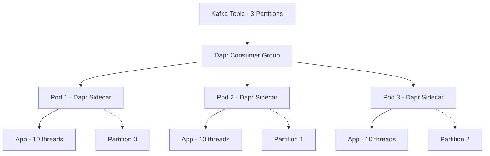

# 消费者组竞争消费机制详解

## 您的理解基本正确！

是的，**一个消息只会被其中一个线程成功消费**，但具体的分配机制比较有层次性。让我详细解释各个层次的工作原理。

## Kafka Consumer Group 的工作机制

### 基础原理

```yaml
Kafka Topic: orders (3个分区)
├── Partition 0: [msg1, msg4, msg7, ...]
├── Partition 1: [msg2, msg5, msg8, ...]  
└── Partition 2: [msg3, msg6, msg9, ...]

Consumer Group: order-processors
├── Consumer Instance 1 → 分配到 Partition 0
├── Consumer Instance 2 → 分配到 Partition 1
└── Consumer Instance 3 → 分配到 Partition 2
```

**关键规则**：
- 同一分区的消息只能被 Consumer Group 内的**一个 Consumer 实例**处理
- Consumer 实例 ≠ 线程，Consumer 实例通常对应一个进程或Pod

## 在 Dapr 场景中的具体实现

### 场景：3个Pod × 10个线程 = 30个处理线程

#### Dapr 架构层次



#### 具体工作流程

```yaml
第一层：Kafka 分区分配
  Partition 0 → Pod 1 的 Dapr Sidecar
  Partition 1 → Pod 2 的 Dapr Sidecar  
  Partition 2 → Pod 3 的 Dapr Sidecar

第二层：Pod 内消息处理
  Pod 1 的 Dapr Sidecar 收到消息 → 转发给 App → 10个线程之一处理
  Pod 2 的 Dapr Sidecar 收到消息 → 转发给 App → 10个线程之一处理
  Pod 3 的 Dapr Sidecar 收到消息 → 转发给 App → 10个线程之一处理
```

### Dapr 消息处理代码示例

```python
# 在每个Pod中运行的应用代码
from dapr.ext.grpc import App
import asyncio
import concurrent.futures

app = App()

# 线程池（10个工作线程）
executor = concurrent.futures.ThreadPoolExecutor(max_workers=10)

@app.subscribe(pubsub_name='pubsub', topic='orders', 
               consumer_group='order-processors')
def handle_order(event):
    """
    这个函数会被Dapr调用
    Dapr保证同一时间只有一个线程在处理这个函数
    """
    # Dapr自动处理线程安全，确保消息不重复处理
    order_id = event.data['order_id']
    
    # 可以在这里使用线程池进行并行处理
    future = executor.submit(process_order_async, order_id)
    result = future.result()  # 等待处理完成
    
    return {"status": "processed", "order_id": order_id}

def process_order_async(order_id):
    """实际的业务处理逻辑，在线程池中执行"""
    # 这里是CPU密集型或IO密集型的业务逻辑
    print(f"Processing order {order_id} in thread {threading.current_thread().name}")
    time.sleep(2)  # 模拟处理时间
    return f"Order {order_id} processed"
```

### 消息分配示例

假设有9条消息进入系统：

```yaml
Kafka Topic: orders
├── Partition 0: [msg1, msg4, msg7]  → Pod 1 处理
├── Partition 1: [msg2, msg5, msg8]  → Pod 2 处理
└── Partition 2: [msg3, msg6, msg9]  → Pod 3 处理

Pod内处理:
  Pod 1: 
    - msg1 → Thread-A 处理
    - msg4 → Thread-B 处理  
    - msg7 → Thread-C 处理
  
  Pod 2:
    - msg2 → Thread-D 处理
    - msg5 → Thread-E 处理
    - msg8 → Thread-F 处理
    
  Pod 3:
    - msg3 → Thread-G 处理
    - msg6 → Thread-H 处理
    - msg9 → Thread-I 处理
```

## 在 Knative 场景中的实现

### Knative + Kafka 的处理方式

```yaml
# 每个Trigger创建独立的Consumer Group
Trigger 1 (payment):
  Consumer Group: payment-trigger-cg
  ├── Pod 1 处理 Partition 0
  ├── Pod 2 处理 Partition 1
  └── Pod 3 处理 Partition 2

Trigger 2 (inventory):  
  Consumer Group: inventory-trigger-cg
  ├── Pod 1 处理 Partition 0 (同样的消息!)
  ├── Pod 2 处理 Partition 1 (同样的消息!)
  └── Pod 3 处理 Partition 2 (同样的消息!)
```

### Knative 消费代码示例

```python
# 每个Pod中的Knative Service代码
from flask import Flask, request
from cloudevents.http import from_http

app = Flask(__name__)

@app.route('/', methods=['POST'])
def handle_event():
    """
    Knative会将事件路由到这个端点
    K8s Service会自动负载均衡到不同Pod
    """
    cloud_event = from_http(request.headers, request.get_data())
    
    # 使用线程池处理
    with concurrent.futures.ThreadPoolExecutor(max_workers=10) as executor:
        future = executor.submit(process_event, cloud_event)
        result = future.result()
    
    return {"status": "processed"}, 200

def process_event(event):
    """在线程池中处理事件"""
    # 业务处理逻辑
    pass
```

## 关键差异对比

### Dapr 竞争消费

```yaml
消息流向:
  msg1 → Partition 0 → Pod 1 → Thread-A ✅
  msg1 → 其他Pod ❌ (不会收到)

特点:
  ✅ 真正的竞争消费
  ✅ 高效的资源利用
  ✅ 自动负载均衡
```

### Knative 多播消费

```yaml
消息流向:
  msg1 → payment-trigger → Pod 1 → Thread-A ✅
  msg1 → inventory-trigger → Pod 2 → Thread-B ✅ (同一消息的副本)
  msg1 → analytics-trigger → Pod 3 → Thread-C ✅ (同一消息的副本)

特点:
  ✅ 事件扇出
  ❌ 资源使用较高
  ✅ 服务解耦
```

## 线程安全和并发控制

### Dapr 的线程安全保证

```python
# Dapr自动保证的线程安全
@app.subscribe(pubsub_name='pubsub', topic='orders')
def handle_order(event):
    # Dapr确保：
    # 1. 同一时间只有一个这个函数的实例在运行
    # 2. 消息按顺序处理（如果启用了顺序处理）
    # 3. 失败时自动重试
    pass
```

### 手动并发控制（如果需要）

```python
import threading
from queue import Queue

# 如果需要更细粒度的并发控制
message_queue = Queue()
processing_lock = threading.Lock()

@app.subscribe(pubsub_name='pubsub', topic='orders')
def handle_order(event):
    # 放入队列，由工作线程处理
    message_queue.put(event)
    return {"status": "queued"}

# 工作线程池
def worker_thread():
    while True:
        event = message_queue.get()
        with processing_lock:
            process_order(event)
        message_queue.task_done()

# 启动10个工作线程
for i in range(10):
    t = threading.Thread(target=worker_thread, daemon=True)
    t.start()
```

## 实际性能影响

### 3个Pod × 10个线程的性能表现

```yaml
Dapr竞争消费:
  并发度: 30 (3 Pod × 10 线程)
  消息分配: 按分区自动分配
  处理效率: 高 (无重复处理)
  资源利用: 高效

Knative多播:
  并发度: 30 × Trigger数量
  消息分配: 每个Trigger都处理所有消息
  处理效率: 中 (有重复处理)
  资源利用: 相对较低
```

## 总结

### 您的理解是正确的！

**是的，在竞争消费模式下，一个消息只会被30个线程中的一个成功消费。**

具体机制：
1. **Kafka层面**：消息按分区分配给不同Pod
2. **Pod层面**：每个Pod的一个线程处理该Pod接收到的消息
3. **线程层面**：Pod内的10个线程可以并发处理不同的消息

### 关键要点
- ✅ **消息唯一性**：每条消息只被处理一次
- ✅ **自动负载均衡**：Kafka自动分配分区给Pod
- ✅ **高并发**：30个线程可以同时处理30条不同的消息
- ✅ **故障容错**：如果一个Pod故障，其分区会自动重新分配

这就是为什么Dapr在高吞吐量场景下比Knative更高效的原因！ 