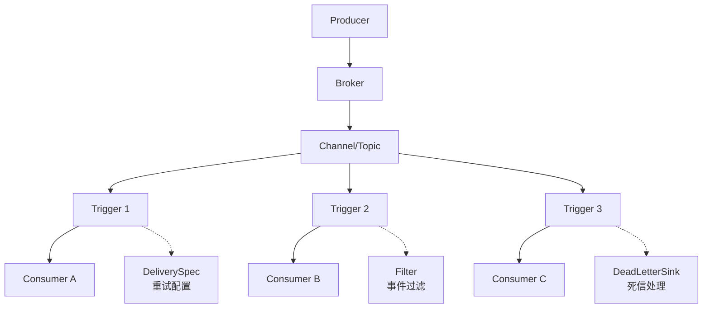
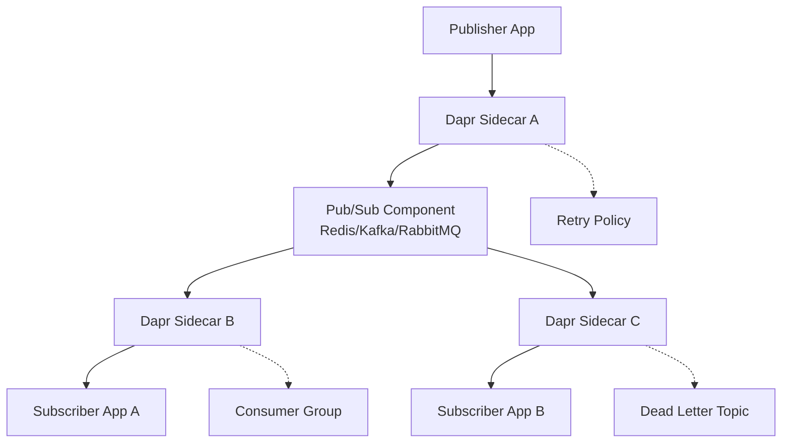

# Knative vs Dapr 消息模式深度对比

## 架构模式对比

### Knative: Producer → Broker → Trigger → Consumer



**特点**:
- 🎯 **事件路由中心化**: Broker 作为事件分发中心
- 🔍 **声明式过滤**: Trigger 基于 CloudEvents 属性过滤
- 📨 **多播模式**: 一个事件可以触发多个 Trigger
- ⚙️ **K8s 原生**: 完全基于 Kubernetes CRD

### Dapr: Publisher → Pub/Sub Component → Subscriber



**特点**:
- 🔗 **Sidecar 代理**: 应用通过本地 sidecar 通信
- 🔌 **组件抽象**: 底层消息系统可插拔
- 📡 **点对点 + 广播**: 支持多种消息模式
- 🌐 **跨平台**: 支持 K8s、VM、物理机等

## 核心特性对比

### 1. 消息重试机制

#### Knative 重试配置

```yaml
apiVersion: eventing.knative.dev/v1
kind: Trigger
metadata:
  name: user-events-trigger
spec:
  broker: default
  filter:
    attributes:
      type: user.created
  subscriber:
    ref:
      apiVersion: v1
      kind: Service
      name: user-service
  delivery:
    retry: 5                    # 最大重试次数
    backoffPolicy: exponential  # 退避策略: linear/exponential
    backoffDelay: PT1S         # 初始延迟: ISO 8601 duration
    deadLetterSink:            # 死信目标
      ref:
        apiVersion: v1
        kind: Service
        name: dead-letter-service
```

**Knative 重试特性**:
- ✅ **指数退避**: 支持 linear/exponential 策略
- ✅ **可配置延迟**: 支持 ISO 8601 duration 格式
- ✅ **死信处理**: DeadLetterSink 自动转发失败消息
- ✅ **每个 Trigger 独立配置**: 细粒度控制
- ❌ **固定重试次数**: 不支持基于时间窗口的重试

#### Dapr 重试配置

```yaml
# Dapr Pub/Sub 组件配置
apiVersion: dapr.io/v1alpha1
kind: Component
metadata:
  name: pubsub
spec:
  type: pubsub.redis
  version: v1
  metadata:
  - name: redisHost
    value: redis-master:6379
  - name: maxRetries
    value: "3"
  - name: maxRetryBackoff
    value: "60s"
  - name: enableDeadLetter
    value: "true"
  - name: deadLetterTopic
    value: "deadletter-topic"
```

```python
# 应用级别重试控制
@dapr_app.subscribe(pubsub='pubsub', topic='user-events', 
                   retry_policy={
                       'max_attempts': 5,
                       'initial_interval': '1s',
                       'max_interval': '30s',
                       'multiplier': 2.0
                   })
def handle_user_event(event):
    # 处理逻辑
    pass
```

**Dapr 重试特性**:
- ✅ **灵活的退避策略**: 支持自定义 multiplier
- ✅ **组件级 + 应用级**: 两层重试控制
- ✅ **时间窗口控制**: maxRetryBackoff 限制
- ✅ **自动死信转发**: 配置简单
- ✅ **底层组件支持**: 利用 Redis/Kafka 的重试机制

### 2. 消息分组 (Consumer Groups)

#### Knative 分组机制

```yaml
# Knative 通过多个 Trigger 实现负载均衡
apiVersion: eventing.knative.dev/v1
kind: Trigger
metadata:
  name: order-processing-trigger-1
spec:
  broker: default
  filter:
    attributes:
      type: order.placed
  subscriber:
    ref:
      apiVersion: apps/v1
      kind: Service
      name: order-processor  # 多副本 Service
---
# 每个 Trigger 可以配置不同的消费者
apiVersion: eventing.knative.dev/v1  
kind: Trigger
metadata:
  name: order-analytics-trigger
spec:
  broker: default
  filter:
    attributes:
      type: order.placed
  subscriber:
    ref:
      apiVersion: v1
      kind: Service
      name: analytics-service  # 不同的消费者服务
```

**Knative 分组特点**:
- 🔄 **多播默认**: 每个 Trigger 都会收到匹配的事件
- ⚖️ **Service 级负载均衡**: 依赖 K8s Service 的负载均衡
- 🎯 **基于过滤器分组**: 通过 filter 实现不同类型的消费组
- ❌ **无竞争消费**: 同一事件会被所有匹配的 Trigger 处理

#### Dapr 分组机制

```python
# Consumer Group A - 订单处理
@dapr_app.subscribe(pubsub='pubsub', 
                   topic='order-events',
                   consumer_group='order-processors')  # 消费者组
def process_order(event):
    # 只有组内一个实例会处理此消息
    pass

# Consumer Group B - 分析处理  
@dapr_app.subscribe(pubsub='pubsub',
                   topic='order-events', 
                   consumer_group='analytics-processors')  # 不同的消费者组
def analyze_order(event):
    # 独立的消费者组，也会收到消息
    pass
```

```yaml
# Redis Streams 消费者组配置
apiVersion: dapr.io/v1alpha1
kind: Component
metadata:
  name: pubsub
spec:
  type: pubsub.redis
  metadata:
  - name: consumerID
    value: "order-processor-1"      # 消费者标识
  - name: enableDeadLetter
    value: "true"
  - name: maxLen
    value: "10000"                  # Stream 最大长度
  - name: maxLenApprox
    value: "true"
```

**Dapr 分组特点**:
- 🏁 **竞争消费**: 同组内只有一个实例处理消息
- 📊 **多组并行**: 不同消费者组可以独立消费同一消息
- 🔄 **自动负载均衡**: 组内实例自动分配消息
- ✅ **原生支持**: 底层消息系统的原生 Consumer Group

### 3. 死信队列 (Dead Letter Queue)

#### Knative 死信处理

```yaml
apiVersion: eventing.knative.dev/v1
kind: Trigger
metadata:
  name: payment-trigger
spec:
  broker: default
  filter:
    attributes:
      type: payment.failed
  subscriber:
    ref:
      apiVersion: v1
      kind: Service
      name: payment-handler
  delivery:
    retry: 3
    backoffPolicy: exponential
    backoffDelay: PT2S
    deadLetterSink:
      ref:
        apiVersion: v1
        kind: Service
        name: payment-dlq-handler
      uri: /deadletter                # 可选的 URI 路径
---
# 死信处理服务
apiVersion: v1
kind: Service
metadata:
  name: payment-dlq-handler
spec:
  selector:
    app: dlq-processor
  ports:
  - port: 80
    targetPort: 8080
```

```python
# 死信处理应用
@app.route('/deadletter', methods=['POST'])
def handle_dead_letter():
    """处理死信消息"""
    try:
        cloud_event = from_http(request.headers, request.get_data())
        
        # 记录失败原因
        logger.error(f"Dead letter: {cloud_event['id']}")
        
        # 可以选择:
        # 1. 存储到数据库用于人工处理
        # 2. 发送告警通知
        # 3. 转发到其他系统
        # 4. 延迟重新投递
        
        return jsonify({"status": "acknowledged"}), 200
    except Exception as e:
        return jsonify({"error": str(e)}), 500
```

**Knative 死信特点**:
- 🎯 **细粒度控制**: 每个 Trigger 独立配置死信目标
- 🔗 **链式处理**: 死信处理器也可以是 Knative Service
- 📝 **保留上下文**: CloudEvent 格式保留原始事件信息
- 🔄 **可重新投递**: 死信处理器可以决定重新投递

#### Dapr 死信处理

```yaml
apiVersion: dapr.io/v1alpha1
kind: Component
metadata:
  name: pubsub
spec:
  type: pubsub.kafka
  version: v1
  metadata:
  - name: brokers
    value: "kafka:9092"
  - name: enableDeadLetter
    value: "true"
  - name: deadLetterTopic
    value: "orders-dlq"              # 自动创建死信 Topic
  - name: maxRetries
    value: "5"
  - name: maxRetryBackoff
    value: "300s"
```

```python
# 主消息处理
@dapr_app.subscribe(pubsub='pubsub', topic='orders')
def process_order(event):
    try:
        # 业务处理逻辑
        if should_fail():
            raise Exception("Processing failed")
        return {"status": "success"}
    except Exception as e:
        # Dapr 自动处理重试和死信转发
        raise

# 死信消息处理
@dapr_app.subscribe(pubsub='pubsub', topic='orders-dlq')
def handle_dead_letters(event):
    """处理死信队列中的消息"""
    try:
        # 死信分析和处理
        logger.error(f"Dead letter received: {event.data}")
        
        # 发送告警或存储用于人工干预
        send_alert(event.data)
        
        return {"status": "acknowledged"}
    except Exception as e:
        # 死信处理失败的处理
        logger.critical(f"DLQ processing failed: {e}")
```

**Dapr 死信特点**:
- 🚁 **自动化程度高**: 配置简单，自动转发死信
- 🏗️ **底层支持**: 利用 Kafka/RabbitMQ 等的死信机制
- 📈 **性能优化**: 死信处理不影响主流程性能
- 🔧 **配置灵活**: 支持自定义死信 Topic 名称

## 高级特性对比表

| 特性 | Knative Eventing | Dapr Pub/Sub | 胜者 |
|------|------------------|--------------|------|
| **消息重试** | ✅ 指数退避 + 可配置 | ✅ 双层重试 + 底层支持 | 🤝 平手 |
| **消费者分组** | ⚠️ 多播模式，无竞争消费 | ✅ 原生 Consumer Group | 🏆 Dapr |
| **死信队列** | ✅ 细粒度配置 | ✅ 自动化程度高 | 🤝 平手 |
| **消息顺序** | ⚠️ 依赖底层 Channel | ✅ 底层组件保证 | 🏆 Dapr |
| **消息去重** | ❌ 需要应用层处理 | ✅ 底层组件支持 | 🏆 Dapr |
| **事务支持** | ❌ 不支持 | ✅ 部分组件支持 | 🏆 Dapr |
| **多租户** | ✅ K8s Namespace 天然支持 | ⚠️ 需要组件配置 | 🏆 Knative |
| **配置复杂度** | 🟡 中等 (需理解 CRD) | 🟢 简单 (API 驱动) | 🏆 Dapr |
| **可观测性** | ✅ K8s 原生监控 | ✅ 内置 tracing | 🤝 平手 |

## 实际场景选择建议

### 🎯 选择 Knative 的场景

```yaml
场景: 事件驱动微服务架构
特点:
  - 需要复杂的事件路由和过滤
  - 同一事件需要触发多个处理器
  - 已有 Kubernetes 运维体系
  - 需要细粒度的重试和死信控制
  
示例: 电商订单事件处理
  order.placed → 
    ├── inventory-service (库存扣减)
    ├── payment-service (支付处理)  
    ├── notification-service (通知发送)
    └── analytics-service (数据分析)
```

### 🚀 选择 Dapr 的场景

```yaml
场景: 消息队列密集型应用
特点:
  - 需要高吞吐量的消息处理
  - 要求强一致性和消息顺序
  - 需要竞争消费模式
  - 希望利用成熟消息系统的高级特性
  
示例: 日志处理系统
  log-events → consumer-group-1 (3个实例竞争消费)
             → consumer-group-2 (独立的分析处理)
```

## 迁移策略

### 从 Knative 迁移到 Dapr

```python
# Knative: 多个 Trigger 处理同一事件
# 迁移前
trigger-1: order.placed → payment-service
trigger-2: order.placed → inventory-service  
trigger-3: order.placed → notification-service

# Dapr: 多个消费者组处理同一消息
# 迁移后
topic: order-placed 
├── consumer-group: payment-processors
├── consumer-group: inventory-processors
└── consumer-group: notification-processors
```

### 从 Dapr 迁移到 Knative

```yaml
# Dapr: Consumer Group 竞争消费
# 迁移前
topic: user-events (consumer-group: user-processors, 5个实例)

# Knative: Service 负载均衡
# 迁移后
trigger: user.* → user-processor-service (5个 Pod 副本)
```

## 总结建议

### 技术决策矩阵

| 需求优先级 | Knative | Dapr | 推荐 |
|------------|---------|------|------|
| **事件路由复杂** | 🟢 强 | 🟡 中 | Knative |
| **消息吞吐量** | 🟡 中 | 🟢 强 | Dapr |
| **运维简单性** | 🟡 中 | 🟢 强 | Dapr |
| **生态集成** | 🟢 强 | 🟡 中 | Knative |
| **多云支持** | 🟡 中 | 🟢 强 | Dapr |

### 最终建议

- **如果您的应用是事件驱动架构，需要复杂的事件路由** → 选择 **Knative**
- **如果您的应用是消息队列密集型，需要高吞吐量处理** → 选择 **Dapr**
- **如果团队更熟悉 Kubernetes 生态** → 选择 **Knative**
- **如果需要跨云、跨平台部署** → 选择 **Dapr**

两个平台都是优秀的解决方案，关键是选择适合您具体业务需求的架构模式。 